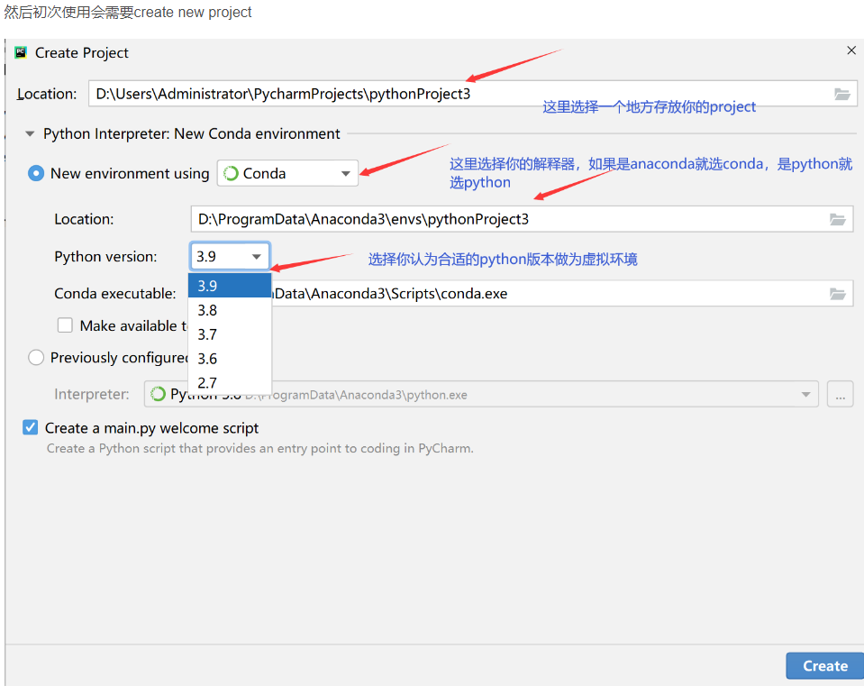
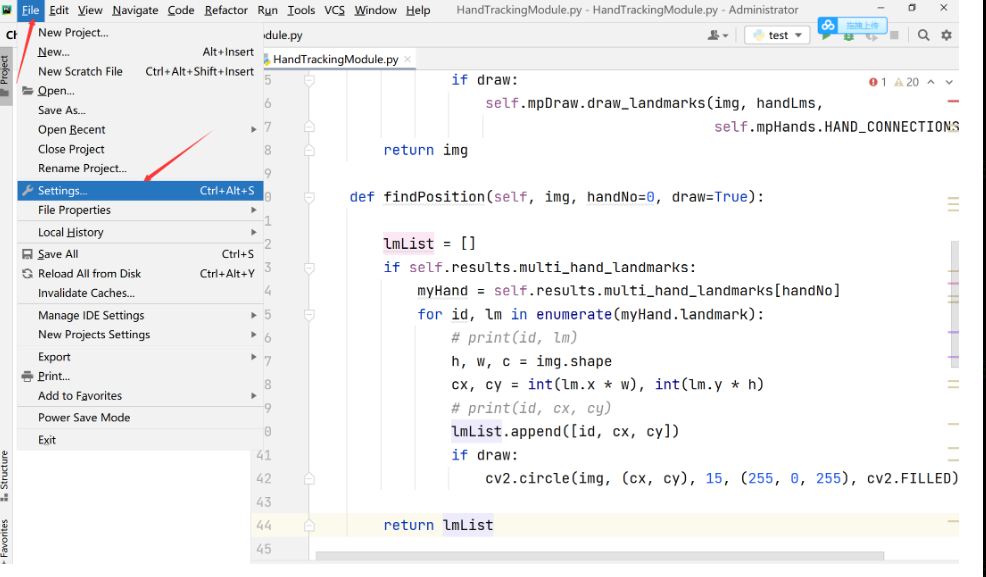
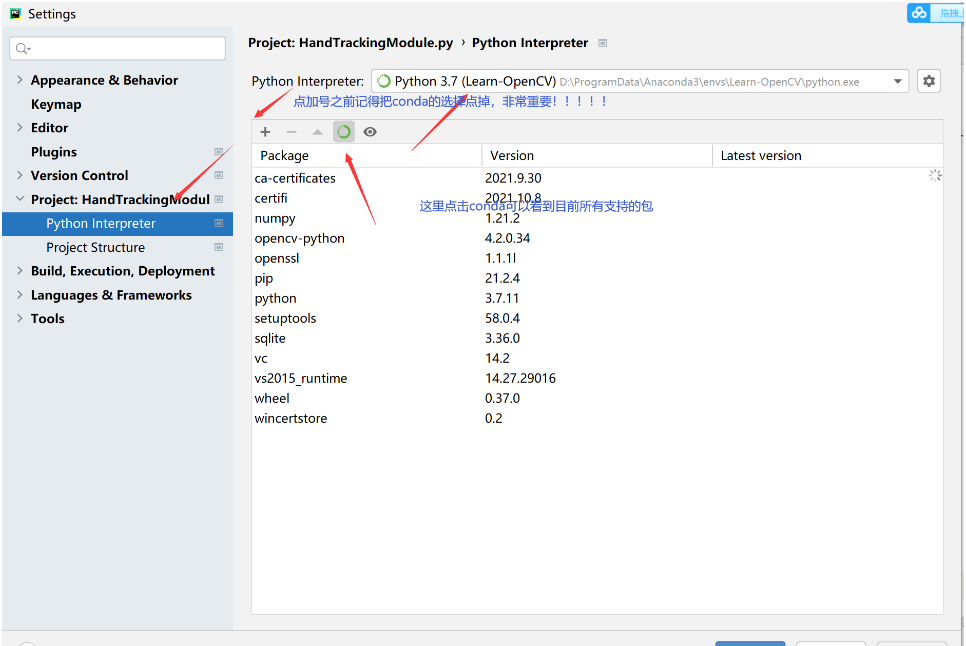
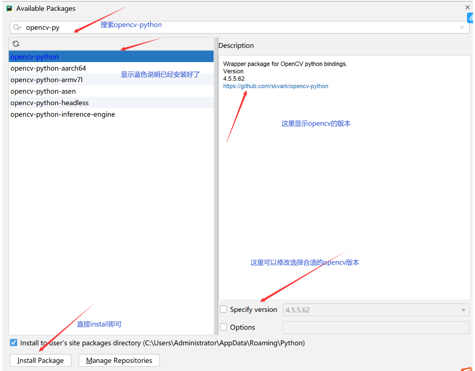
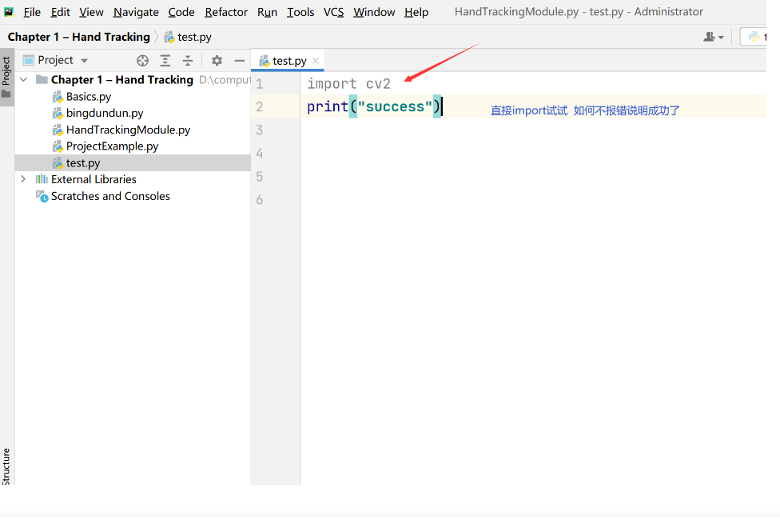
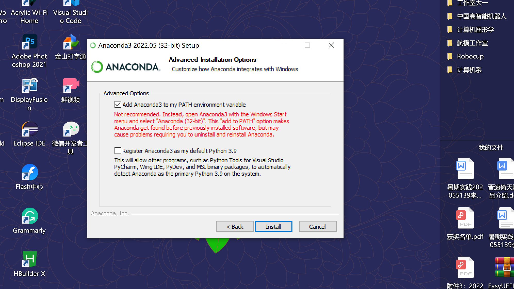
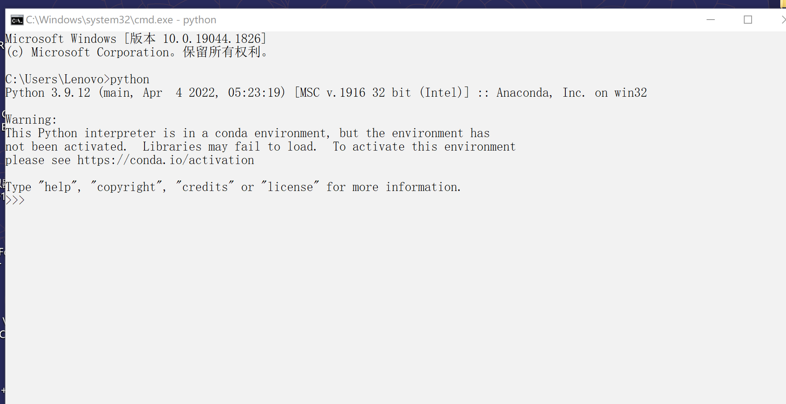
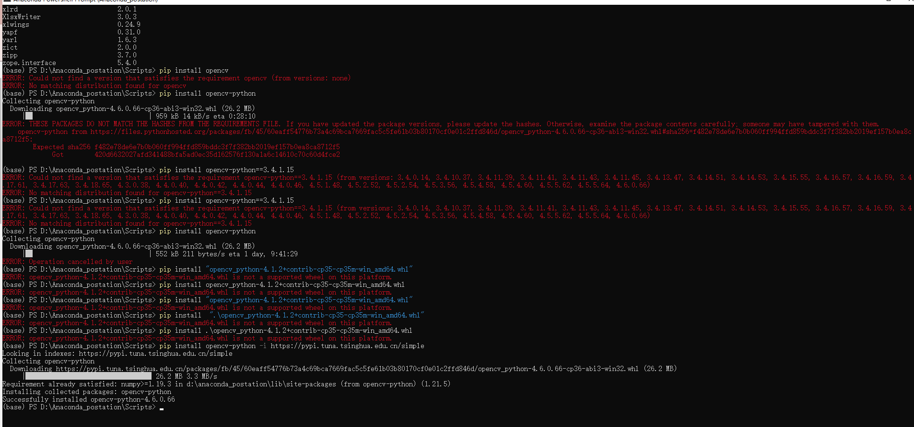
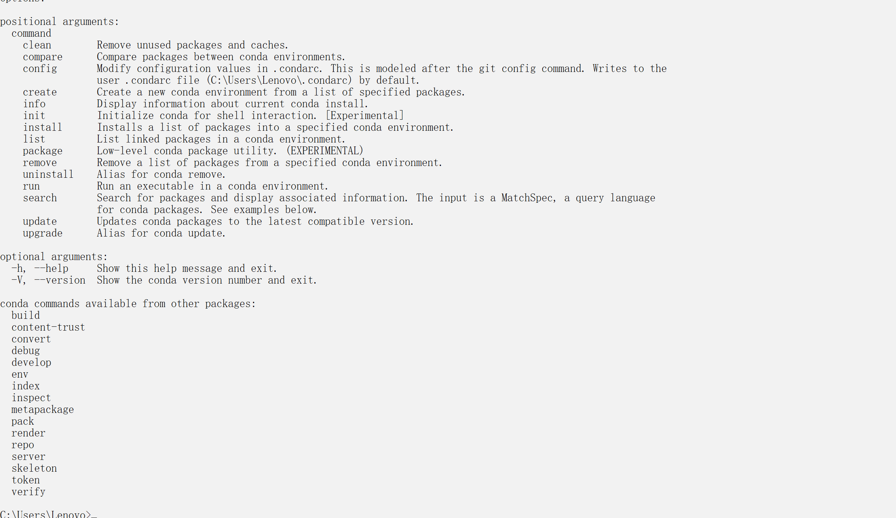
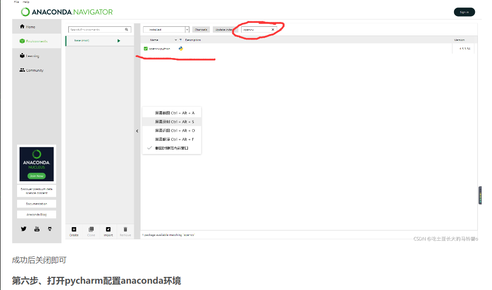

# 1.主要流程


1. 新建文件夹，安装anacoda3 到此文件夹
2. 安装完成后，到pycharm 中新建项目

- 


紧接着是opencv的配置



















# 2. 遇到无法去pip install opencv时

```
https://blog.csdn.net/weixin_51210777/article/details/120711330?ops_request_misc=%257B%2522request%255Fid%2522%253A%2522166281393516782248536687%2522%252C%2522scm%2522%253A%252220140713.130102334..%2522%257D&request_id=166281393516782248536687&biz_id=0&utm_medium=distribute.pc_search_result.none-task-blog-2~all~sobaiduend~default-2-120711330-null-null.142^v47^pc_rank_34_default_2,201^v3^add_ask&utm_term=pycharm%E9%85%8D%E7%BD%AEopencv%E7%8E%AF%E5%A2%83&spm=1018.2226.3001.4187
```




# 3. 检查环境变量

win+r    打开运行对话框，输入cmd然后回车

输入conda

如果想这样一样，则为成功




不成功则：

```httP
https://blog.csdn.net/weixin_43914658/article/details/108785084?ops_request_misc=%257B%2522request%255Fid%2522%253A%2522166281620516800192243492%2522%252C%2522scm%2522%253A%252220140713.130102334..%2522%257D&request_id=166281620516800192243492&biz_id=0&utm_medium=distribute.pc_search_result.none-task-blog-2~all~top_positive~default-1-108785084-null-null.142^v47^pc_rank_34_default_2,201^v3^add_ask&utm_term=anaconda%E7%8E%AF%E5%A2%83%E5%8F%98%E9%87%8F%E9%85%8D%E7%BD%AE&spm=1018.2226.3001.4187
```


# 4.




```http
https://blog.csdn.net/weixin_51210777/article/details/120711330?ops_request_misc=%257B%2522request%255Fid%2522%253A%2522166281393516782248536687%2522%252C%2522scm%2522%253A%252220140713.130102334..%2522%257D&request_id=166281393516782248536687&biz_id=0&utm_medium=distribute.pc_search_result.none-task-blog-2~all~sobaiduend~default-2-120711330-null-null.142^v47^pc_rank_34_default_2,201^v3^add_ask&utm_term=pycharm%E9%85%8D%E7%BD%AEopencv%E7%8E%AF%E5%A2%83&spm=1018.2226.3001.4187
```

